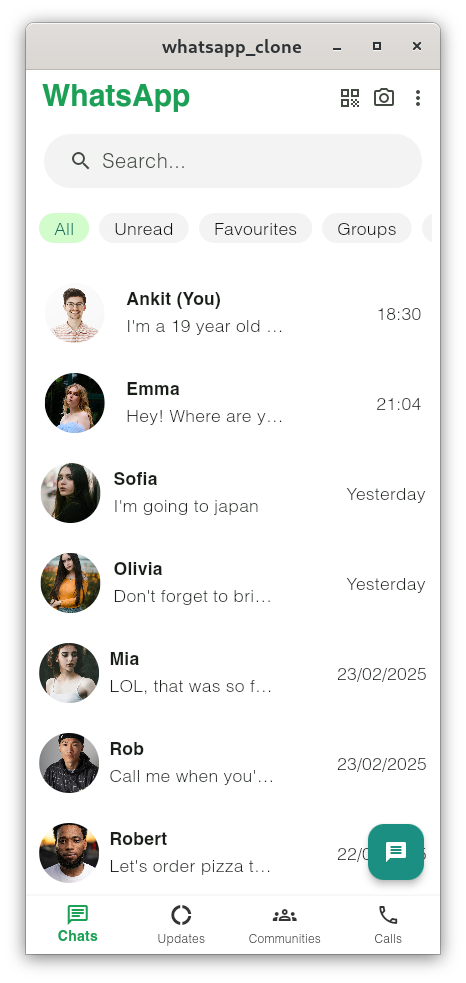
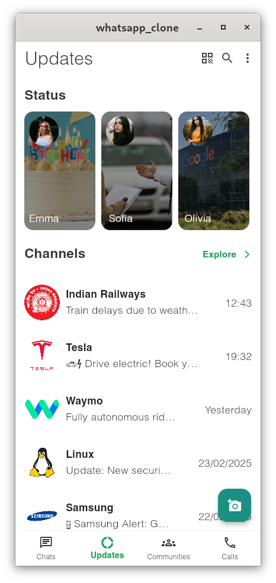
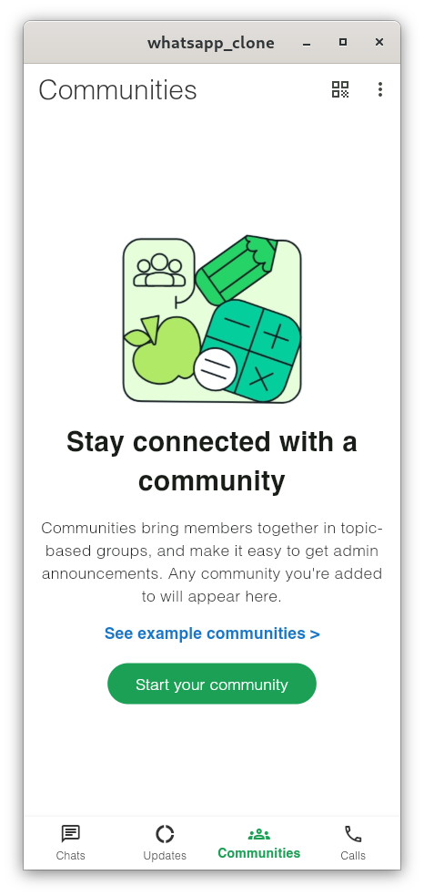
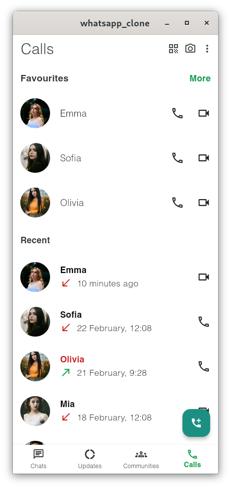

# WhatsApp Clone - Flutter

A fully functional **UI clone** of WhatsApp built with Flutter. It includes profile viewing and status viewing features.

## Features
- 🖼️ **Status UI** - View status updates just like WhatsApp.
- 🎨 **Responsive Design** - Works seamlessly on **mobile, tablet, and desktop**.
- 📱💻 **Multi-Device Support** - Use it on smartphones, tablets, and laptops with adaptive UI.

## Tech Stack
- **Flutter** - Cross-platform UI development.
- **Dart** - Programming language for Flutter.

## Installation
1. Clone the repository:
   ```bash
   git clone https://github.com/ankit-kr-codes/WhatsApp-Clone.git
   ```
2. Navigate to the project directory:
   ```bash
   cd whatsapp_clone
   ```
3. Install dependencies:
   ```bash
   flutter pub get
   ```
4. Run the app:
   ```bash
   flutter run
   ```

## Screenshots
| Chat Screen | Updates Screen | Communities Screen | Call Screen |
|------------|--------------|-------------|-------------|
|  |  |  |  |

## Contributing
Feel free to contribute! Fork the repo, make your changes, and submit a PR.


